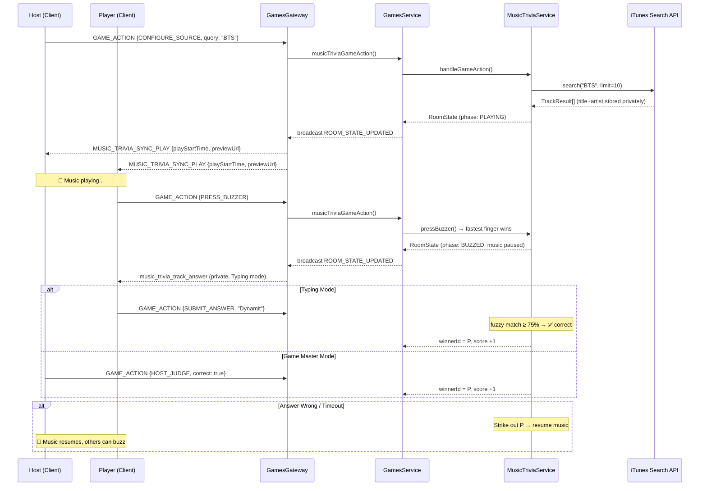

# 🎵 Music Trivia Module — Implementation Plan

เกมทายเพลง Multiplayer แบบ Real-time สำหรับ kz-game-hub ใช้ระบบ Buzzer แย่งตอบ รองรับ 2 โหมด (Typing / Game Master) และดึงเพลงผ่าน Adapter Pattern (Phase 1: iTunes)

---

## Resolved Decisions

| Question | Decision |
|----------|----------|
| Minimum players | **2 คน** เล่นได้เลย |
| จำนวนเพลงต่อเกม | **Suggested options**: 5 / 10 / 15 / 20 เพลง (โฮสต์เลือก) |
| คะแนนต่อเพลง | **1 แต้มเท่ากัน** ทุกเพลง |
| Hint System | **ไม่มี** — ตัดออก |
| Phase 1 Source | **iTunes เท่านั้น** — แต่ Adapter Pattern พร้อมเสียบ Spotify/YouTube ทีหลัง |

---

## User Review Required

> [!WARNING]
> **Sync Play ข้าม Client** — การ sync เพลงให้เริ่มพร้อมกัน 100% ทำได้ยากผ่าน network เนื่องจาก latency ต่างกัน แผนคือใช้ server ส่ง `play_at` timestamp + offset ให้ client คำนวณ delay เอง (เทียบกับ NTP-like round-trip) ซึ่งจะ "ใกล้เคียง" แต่ไม่ exact ถ้ารับได้ก็ใช้วิธีนี้

---

## Proposed Changes

ตาม game module pattern ที่มีอยู่ ต้องแก้ **4 จุดหลัก** + เพิ่ม module ใหม่

---

### `@repo/types` — Shared Types & Events

#### [NEW] [music-trivia.ts](file:///Users/kridsadaintahson/Public/KriZad/Code/kz-game-hub/packages/types/src/music-trivia.ts)

```typescript
// Game phases
export type MusicTriviaPhase =
  | 'SETUP'           // Host configures music source & settings
  | 'LOADING'         // Server fetching tracks
  | 'PLAYING'         // Music playing, waiting for buzzer
  | 'BUZZED'          // Someone buzzed, music paused
  | 'ANSWERING'       // Buzzed player is answering (typing or verbal)
  | 'ANSWER_RESULT'   // Showing if answer was correct/wrong
  | 'REVEAL'          // Host revealed the answer (no winner)
  | 'ROUND_RESULT'    // Showing round scores
  | 'FINISHED';       // Game over

// Music source types (Phase 1: ITUNES only, extensible)
export type MusicSourceType = 'ITUNES' | 'SPOTIFY' | 'YOUTUBE';

// Game modes
export type MusicTriviaMode = 'TYPING' | 'GAME_MASTER';

// Track info (public — no answer spoilers)
export interface MusicTriviaTrack {
  id: string;
  previewUrl: string;          // Audio URL or YouTube videoId
  sourceType: MusicSourceType;
  durationMs: number;
  artworkUrl?: string;
  // title + artist are SERVER-ONLY, never broadcast during play
}

// Buzzer press record
export interface BuzzerPress {
  playerId: string;
  timestamp: number;
  reactionTimeMs: number;
}

// Per-round state (broadcast-safe)
export interface MusicTriviaRound {
  roundNumber: number;
  track: MusicTriviaTrack;
  buzzerPresses: BuzzerPress[];
  currentBuzzerId: string | null;
  struckOutIds: string[];       // Players who answered wrong this round
  answeredCorrectly: boolean;
  winnerId: string | null;
}

// Main game state (broadcast-safe)
export interface MusicTriviaState {
  phase: MusicTriviaPhase;
  mode: MusicTriviaMode;
  sourceType: MusicSourceType;
  totalRounds: number;
  currentRound: MusicTriviaRound | null;
  roundHistory: Array<{
    roundNumber: number;
    winnerId: string | null;
    trackTitle: string;
    artistName: string;
    artworkUrl?: string;
  }>;
  scores: Record<string, number>;  // playerId → total points (1 per correct)
  hostPlays: boolean;
  answerTimeoutMs: number;
  playStartTime?: number;
  revealedAnswer?: {
    title: string;
    artist: string;
    artworkUrl?: string;
  };
}

// Action types for GAME_ACTION pattern
export type MusicTriviaActionType =
  | 'CONFIGURE_SOURCE'    // Host sets source + query
  | 'START_ROUND'         // Host starts playing music
  | 'PRESS_BUZZER'        // Player presses buzzer
  | 'SUBMIT_ANSWER'       // Typing mode: buzzed player submits text
  | 'HOST_JUDGE'          // GM mode: host approves/rejects
  | 'REVEAL_ANSWER'       // Host reveals answer (skip)
  | 'NEXT_ROUND'          // Host advances to next round
  | 'END_GAME';           // Host ends game early
```

#### [MODIFY] [core.ts](file:///Users/kridsadaintahson/Public/KriZad/Code/kz-game-hub/packages/types/src/core.ts)

- Add `MUSIC_TRIVIA = 'MUSIC_TRIVIA'` to `GameType` enum
- Add `musicTriviaState?: MusicTriviaState` to `RoomState` interface
- Add Music Trivia socket events to `SOCKET_EVENTS`:
  ```
  MUSIC_TRIVIA_TRACK_ANSWER: 'music_trivia_track_answer'  // Private: server→buzzed player
  MUSIC_TRIVIA_SYNC_PLAY: 'music_trivia_sync_play'        // Broadcast: play start signal
  ```
- Add config fields to `RoomConfig`:
  ```typescript
  musicTriviaMode?: MusicTriviaMode;
  musicTriviaSource?: MusicSourceType;
  musicTriviaRounds?: number;        // 5 | 10 | 15 | 20
  musicTriviaHostPlays?: boolean;
  musicTriviaAnswerTimeoutMs?: number;
  ```

#### [MODIFY] [index.ts](file:///Users/kridsadaintahson/Public/KriZad/Code/kz-game-hub/packages/types/src/index.ts)

- Add `export * from './music-trivia'`

---

### `apps/api` — Backend Service

#### [NEW] [music-trivia/music-trivia.service.ts](file:///Users/kridsadaintahson/Public/KriZad/Code/kz-game-hub/apps/api/src/games/music-trivia/music-trivia.service.ts)

หัวใจของ module — จัดการ game logic ทั้งหมด:

| Method | Description |
|--------|-------------|
| `startGame(room, requesterId)` | Init state, set defaults from config, min 2 players |
| `handleGameAction(room, clientId, action)` | Main dispatcher ตาม `MusicTriviaActionType` |
| `configureSource(room, clientId, query)` | Fetch tracks via adapter, store answers server-side |
| `startRound(room, clientId)` | Start playing music, set `playStartTime` |
| `pressBuzzer(room, clientId)` | Record buzzer press, pause music, grant answer right |
| `submitAnswer(room, clientId, answer)` | Typing mode: fuzzy-match answer |
| `hostJudge(room, clientId, correct)` | GM mode: host decides ✅/❌ |
| `revealAnswer(room, clientId)` | Show correct answer to everyone |
| `nextRound(room, clientId)` | Advance to next track |
| `endGame(room, clientId)` | Finish game, calculate final scores |
| `resetGame(room, requesterId)` | Reset to LOBBY |

**Scoring**: ตอบถูก = **+1 แต้ม** เท่ากันทุกเพลง ไม่มี bonus

**Fuzzy matching** (Typing mode): ใช้ Levenshtein distance ratio — ถ้า similarity ≥ 0.75 (75%) ถือว่าถูก รองรับการพิมพ์ผิดเล็กน้อย, ลืมเว้นวรรค, ตัวเล็ก-ใหญ่ Implement เอง (ไม่พึ่ง external lib)

**Secret data management**: Track answers (title + artist) เก็บใน `Map<roomCode, TrackAnswer[]>` ใน service ไม่ส่งผ่าน broadcast state

**Min players**: 2 คน (host สามารถเล่นเองได้ถ้า `hostPlays = true`)

#### [NEW] [music-trivia/music-source-adapter.ts](file:///Users/kridsadaintahson/Public/KriZad/Code/kz-game-hub/apps/api/src/games/music-trivia/music-source-adapter.ts)

Adapter interface + factory — ออกแบบให้เพิ่ม source ใหม่ได้ง่ายมาก:

```typescript
// Interface ที่ทุก adapter ต้อง implement
export interface MusicSourceAdapter {
  readonly sourceType: MusicSourceType;
  search(query: string, limit: number): Promise<TrackResult[]>;
}

// ผลลัพธ์มาตรฐานจาก adapter ทุกตัว
export interface TrackResult {
  id: string;
  title: string;        // Secret — คำตอบ
  artist: string;       // Secret — คำตอบ
  previewUrl: string;
  durationMs: number;
  artworkUrl?: string;
  sourceType: MusicSourceType;
}

// Factory — เพิ่ม adapter ใหม่แค่ register ที่นี่
export class MusicSourceFactory {
  private adapters = new Map<MusicSourceType, MusicSourceAdapter>();

  register(adapter: MusicSourceAdapter): void { ... }
  get(type: MusicSourceType): MusicSourceAdapter { ... }
}
```

> [!TIP]
> **เพิ่ม source ใหม่ภายหลัง** — แค่ (1) สร้าง class ที่ implement `MusicSourceAdapter` (2) register ใน factory ไม่ต้องแก้ game logic เลย

#### [NEW] [music-trivia/adapters/itunes.adapter.ts](file:///Users/kridsadaintahson/Public/KriZad/Code/kz-game-hub/apps/api/src/games/music-trivia/adapters/itunes.adapter.ts)

- ใช้ iTunes Search API (`https://itunes.apple.com/search?term=...&media=music&limit=...`)
- ไม่ต้อง API key
- คัดเฉพาะ track ที่มี `previewUrl` (ไม่ null)
- Map ผลลัพธ์เป็น `TrackResult[]`

#### [NEW] [music-trivia/music-trivia.service.spec.ts](file:///Users/kridsadaintahson/Public/KriZad/Code/kz-game-hub/apps/api/src/games/music-trivia/music-trivia.service.spec.ts)

Unit tests ครอบคลุม:
- Phase transitions (SETUP → LOADING → PLAYING → BUZZED → ANSWERING → etc.)
- Buzzer ordering (fastest wins)
- Strike out logic (ตอบผิด → lock → resume music → เปิดให้คนอื่นกด)
- Fuzzy matching threshold (75% similarity)
- Host-only actions (GM mode judge ✅/❌)
- Score = 1 per correct answer
- Min 2 players
- Round count (5/10/15/20)
- Edge cases: all players struck out → reveal + next round, timeout
- Adapter factory: get unknown source → error

#### [MODIFY] [games.module.ts](file:///Users/kridsadaintahson/Public/KriZad/Code/kz-game-hub/apps/api/src/games/games.module.ts)

- Import & register `MusicTriviaService` in providers

#### [MODIFY] [games.service.ts](file:///Users/kridsadaintahson/Public/KriZad/Code/kz-game-hub/apps/api/src/games/games.service.ts)

- Add `MusicTriviaService` to constructor DI
- `createRoom()`: Add `MUSIC_TRIVIA` case — init default config:
  ```typescript
  room.config.musicTriviaMode = 'TYPING';
  room.config.musicTriviaSource = 'ITUNES';
  room.config.musicTriviaRounds = 10;
  room.config.musicTriviaHostPlays = true;
  room.config.musicTriviaAnswerTimeoutMs = 15000;
  ```
- `assignRoles()`: Add `MUSIC_TRIVIA` → delegate to `musicTriviaService.startGame()`
- `resetGame()`: Add `MUSIC_TRIVIA` → delegate to `musicTriviaService.resetGame()`
- `joinRoom()`: Add `musicTriviaState` reconnection mapping (remap buzzer/striker socketIds)
- Add `musicTriviaGameAction()` delegation method

#### [MODIFY] [games.gateway.ts](file:///Users/kridsadaintahson/Public/KriZad/Code/kz-game-hub/apps/api/src/games/games.gateway.ts)

- Extend `GAME_ACTION` handler: add `GameType.MUSIC_TRIVIA` → `musicTriviaGameAction()`
- After buzzer press in TYPING mode → `server.to(socketId).emit('music_trivia_track_answer', ...)`
- On round start → broadcast `MUSIC_TRIVIA_SYNC_PLAY` with `{ playStartTime, previewUrl, sourceType }`

---

### `apps/web` — Frontend Components

#### [NEW] [MusicTriviaView.tsx](file:///Users/kridsadaintahson/Public/KriZad/Code/kz-game-hub/apps/web/src/components/games/music-trivia/MusicTriviaView.tsx)

Main view component — conditionally renders based on `phase`:

| Phase | UI |
|-------|----|
| `SETUP` | Search input (ค้นหาจาก iTunes), round count selector (5/10/15/20), mode toggle |
| `LOADING` | Loading spinner + "กำลังโหลดเพลง..." |
| `PLAYING` | 🔊 Audio waveform CSS animation + **ปุ่ม BUZZER ขนาดใหญ่** กลางจอ |
| `BUZZED` | แสดงว่าใครกดติด + countdown timer สำหรับตอบ |
| `ANSWERING` | Typing: input box + countdown / GM: host ✅❌ panel |
| `ANSWER_RESULT` | ✅ ถูก / ❌ ผิด animation + "+1" score popup |
| `REVEAL` | แสดงชื่อเพลง + ศิลปิน + artwork |
| `ROUND_RESULT` | Mini scoreboard + "Next Round" (host) |
| `FINISHED` | Final leaderboard + Play Again |

**Design highlights:**
- ปุ่ม Buzzer: วงกลมใหญ่กลางจอ, gradient สีแดง, pulse animation ตอนเพลงเล่น, haptic feedback (Vibration API)
- Waveform: CSS animated bars (5-7 แท่ง) แสดงว่าเพลงกำลังเล่น
- Audio player: `<audio>` element ซ่อน — เล่น preview URL จาก iTunes
- Strike out: ปุ่ม Buzzer เปลี่ยนเป็น 🔒 + สีเทาถ้าถูก lock

#### [NEW] [MusicTriviaRules.tsx](file:///Users/kridsadaintahson/Public/KriZad/Code/kz-game-hub/apps/web/src/components/games/music-trivia/MusicTriviaRules.tsx)

Rules modal content สำหรับ Music Trivia

#### [MODIFY] [useGameStore.ts](file:///Users/kridsadaintahson/Public/KriZad/Code/kz-game-hub/apps/web/src/store/useGameStore.ts)

- Add `musicTriviaGameAction(action)` — reuses `GAME_ACTION` event pattern
- Add listener: `MUSIC_TRIVIA_TRACK_ANSWER` → store track answer locally for answer input display
- Add listener: `MUSIC_TRIVIA_SYNC_PLAY` → trigger audio playback with sync offset
- Add state: `musicTriviaTrackAnswer: { title: string; artist: string } | null`

#### [MODIFY] [page.tsx](file:///Users/kridsadaintahson/Public/KriZad/Code/kz-game-hub/apps/web/src/app/page.tsx)

- Import `MusicTriviaView`
- Add `GameType.MUSIC_TRIVIA` case in game view rendering chain
- Add game name badge in lobby room list
- Add Music Trivia config section in lobby (mode, rounds, host plays)

---

### `i18n` — Translations

#### [MODIFY] [schema.ts](file:///Users/kridsadaintahson/Public/KriZad/Code/kz-game-hub/apps/web/src/i18n/dictionaries/schema.ts)

Add `gameMusicTrivia` section + `musicTrivia` in `lobby.gameNames` + `rules.musicTrivia`

#### [MODIFY] [th.ts](file:///Users/kridsadaintahson/Public/KriZad/Code/kz-game-hub/apps/web/src/i18n/dictionaries/th.ts) & [en.ts](file:///Users/kridsadaintahson/Public/KriZad/Code/kz-game-hub/apps/web/src/i18n/dictionaries/en.ts)

Add translations for all new keys

---

## Architecture Diagram



---

## File Structure (New Files)

```
packages/types/src/
  └── music-trivia.ts                          [NEW]

apps/api/src/games/music-trivia/
  ├── music-trivia.service.ts                  [NEW] Game logic
  ├── music-trivia.service.spec.ts             [NEW] Unit tests
  ├── music-source-adapter.ts                  [NEW] Interface + Factory
  └── adapters/
      └── itunes.adapter.ts                    [NEW] iTunes Search API

apps/web/src/components/games/music-trivia/
  ├── MusicTriviaView.tsx                      [NEW] Main game view
  └── MusicTriviaRules.tsx                     [NEW] Rules modal
```

---

## Verification Plan

### Automated Tests
```bash
pnpm -F api test -- --testPathPattern=music-trivia  # Unit tests
pnpm build --filter=@repo/types                      # Type compilation check
pnpm dev                                             # Full integration
```

### Manual Verification
1. สร้างห้อง Music Trivia → search "BTS" จาก iTunes → เลือก 10 เพลง
2. เริ่มเกม → ฟังเพลง → กด Buzzer → พิมพ์คำตอบ (Typing mode)
3. ทดสอบ fuzzy: พิมพ์ "dynamit" แทน "Dynamite" → ต้องได้แต้ม
4. ทดสอบ Strike out: ตอบผิด → 🔒 lock → เพลงเล่นต่อ → คนอื่นกดได้
5. ทดสอบ GM mode: Host กด ✅/❌ + Reveal
6. ทดสอบ scoring: ทุกเพลงให้ 1 แต้มเท่ากัน
7. ทดสอบ round options: ลองตั้ง 5, 10, 15, 20 เพลง
8. ทดสอบ reconnection: ปิดแท็บแล้วเข้าใหม่
9. ทดสอบ 2 players: host + 1 player เล่นได้
